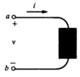

## **Exercícios**

*1 -* Uma suíte de um apartamento possui vários equipamentos elétricos e cujas potências e tempo de uso diário estão na tabela abaixo. A partir desses dados determine:
*a)* A energia elétrico em $$[KWh]$$ consumida por dia;
*b)* O custo mensal em **Reais (R$)**, sabendo-se que a companhia de energia cobra $$0,31636 [KWh]$$ reais.

Equipamento | Tempo de Uso Diário
-|-
 3 lâmpadas de $20[W]$ cada uma | 6h
 1 ventilador de $150[W]$ | 3h
1 ar-condicionado $12000 [BTU/h] = 1,6[KW]$ | 240 min
1 TV de $120[W]$ | 4h e 30 min
1 chuveiro de $6400[W]$ | 28 min

---

*2 -* A carga total que entra por um terminal de elemento é $q = t^{5} - 2t [C]$. Qual é o valor da corrente nos instantes de tempo $t = 2[s]$ e $t = 4[s]$.

---

*3 -* Assinale verdadeiro ou falso para as seguintes afirmações, e justifique:
- [ ] Os prótons têm o dobro da carga dos elétrons visto que prótons são positivos.
- [ ] $2,5 \cdot 10^{5}$ elétrons tem uma carga correspondente à $4 \cdot 10^{-14} [C]$.
- [ ] A energia $[W]$ necessária para deslocar uma carga $Q = 780 [mC]$ de um ponto $A$ cujo potencial é $P_A = 8[V]$ para um ponto $B$ cujo potencial é $P_B = 2[V]$ será $W = 4,68 [J]$.

---

*4 -* Assinale verdadeiro ou falso para as seguintes afirmações, e justifique:
- [ ] Um elemento do circuito absorve energia quando uma corrente sai do terminal positivo. Ou seja, uma fonte externa está entregando energia ao elemento.
- [ ] Potência é a velocidade com que a energia é dissipada.
- [ ] Em um elemento do circuito, se a corrente sai do positivo significa que o elemento é ativo.
- [ ] Receptores são elementos ativos (motores por exemplo) e Geradores são elementos passivos (por exemplo, uma resistência de um chuveiro pois aquece a água).

---

*5 -* Considerano a tabela abaixo, obtida em laboratório de circuito elétrico construído a partir de um Resistor ligado à uma Fonte C.C. (Circuito Contínuo) e instrumentos de medida.

$V[V]$ | $I[A]$
-|-
 12 | 0,25
 12,5 | 0,260417
 13 | 0,270833
 13,5 | 0,28125
 14 | 0,291667
 14,5 | 0,302083
 15 | 0,3125
 15,5 | 0,322917
 16 | 0,333333
 16,5 | 0,34375
 17 | 0,354167
 17,5 | 0,364583
 18 | 0,375

 Determine:
 *a)* O Gráfico $V \times I$;
 *b)* A resistência do resistor;
 *c)* A potência dissipada pelo resistor quando submetido a $400[V]$.

 ---

 *6 -* Uma torradeira tem resistência elétrica de $4[\ohm]$. Pergunta-se:
 *a*) A resistência elétrica internada da torradeira muda quando aumentamos a tensão a que é submetida, por exemplo de $127[V]$ para $220[V]$? Explique.
 *b)* Qual a potência dissipada por essa torradeira quando for ligada a $100[V]$?
 *c)* O que acontece com a corrente elétrica na torradeira quando triplicamos a tensão?

 ---

 *7 -* Calcule $V$ se $I = [mA]$ e o elemento está:
 *a)* absorvendo uma potência de $P = 24[W]$ e;
 *b)* fornecendo para o circuito externo uma potência $P = 36[W]$.

 ---

 *8 -* Considere um fio de constantan (formato cilíndrico) com $1[m]$ de comprimento e $0,5[cm]$ de raio (seção transversal circular). Considere a resistividade da constantan sendo $\rho = 4,9 \cdot 10^{-7}[\ohm \cdot m]$ e determine:
 *a)* A intensidade da corrente que percorre esse fio ao ser aplicada em suas extermidades uma tensão de $12[V]$.
 *b)* A condutância do fio expressa em Siemens $[S]$.

 ---

 *9)* Se $i = 9[mA]$ e $v = 12[V]$ no elemento do circuito abaixo, então, calcule:
 *a)* a potência absorvida pelo elemento.
 *b)* a energia entre entre $2[s]$ e $6[s]$.

  

---

*10)* Calcule o número de nano-segundos em:
*a)* $13,5[s]$.
*b)* $700,5[ms]$.
*c)* $452[\mu s]$.

---

*11)* Calcule:
*a)* O número de segundo em $400[\mu s]$.
*b)* O número de quilômetros em $85300[m]$.

---

*12)* Coloque tudo em base 10:
*a)* $100 \cdot 10^{3}$.
*b)* $0,009 \cdot 10^{-4}$.
*c)* $0,000001$.
*d)* $1 \cdot 10^{-5} \cdot 10^{3}$.
*e)* $0,001 \cdot 10^{-3} \cdot 10^{6}$.