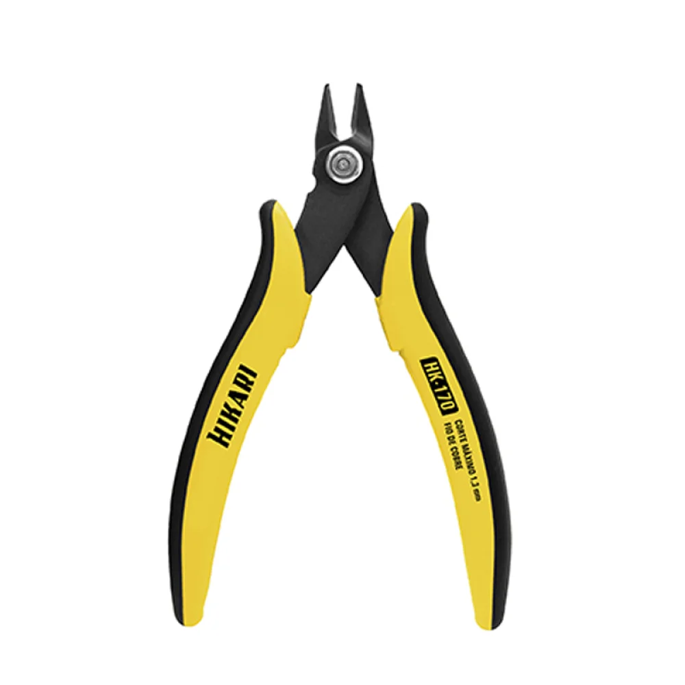

## **Materiais e Requisitos Técnicos**

### 1. Materiais e Componentes:
- **Aubess DIY SMART SWITCH (ou similar Tuya):** O dispositivo principal, que é um módulo relé inteligente para automação.
- **Lâmpada:** Uma lâmpada de LED ou incandescente compatível com a tensão da sua rede elétrica ($127[V]$ ou $220[V]$).
- **Bocal:** O suporte para a lâmpada (soquete), como o mostrado na imagem.
- **Cabos Elétricos Flexíveis (cobre):**
  - **Bitola:** Recomendado $1,5 [mm]^{2}$ para circuitos de iluminação, conforme a `NBR 5410`.
  - **Cores:** Utilize cabos de cores distintas para facilitar a identificação, como vermelho para a fase, azul para o neutro.
- **Ferramentas:**
  - Alicate de corte e alicate de decapagem.
  - Chave de fenda ou Phillips, dependendo do tipo de parafuso do dispositivo.
  - Multímetro (altamente recomendado para verificar a tensão e a ausência de energia).

### 2. Requisitos Técnicos:
- **Tensão:** O dispositivo opera em uma faixa de **100V a 250V (bivolt)**, sendo compatível com as redes 127V e 220V do Brasil.
- **Corrente Máxima:** Verifique a amperagem máxima suportada pelo modelo do seu switch (geralmente 10A ou 16A). A bitola dos cabos deve ser dimensionada para essa corrente.
- **Conexão Wi-Fi:** O dispositivo requer uma rede Wi-Fi de **2,4 GHz** para funcionar. Ele não se conectará a redes 5 GHz.
- **Aplicação:** O dispositivo é projetado para atuar como um interruptor para cargas de iluminação. Não é um dimmer, portanto, não serve para ajustar a intensidade da luz.
- **Necessidade de Fio Neutro:** A maioria dos smart switches, incluindo os baseados na plataforma Tuya, precisa de um fio neutro para alimentar sua eletrônica interna e se manter conectado à rede Wi-Fi.

---

## **Guia de Montagem Passo a Passo**
Siga estas instruções com atenção para montar o circuito de acordo com a imagem.

### **Passo 1: Desligar a Energia (Etapa de Segurança Crítica)**
- Localize o disjuntor do circuito elétrico onde você irá trabalhar e desligue-o.
- Use um multímetro ou uma chave de teste para confirmar que não há mais tensão nos fios onde a instalação será feita.

### **Passo 2: Conectar a Entrada de Energia (L-in e N-in)**
- Identifique os fios de entrada que vêm da rede elétrica (da sua tomada ou do seu quadro de distribuição).
- Desencape a ponta do fio de fase (`vermelho` na imagem) e conecte-o ao terminal L-in do Aubess DIY SMART SWITCH.
- Desencape a ponta do fio neutro (`azul` na imagem) e conecte-o ao terminal N-in do dispositivo.

### **Passo 3: Conectar a Saída para a Lâmpada (L-out e N-out)**
- Pegue um cabo que servirá de retorno (`vermelho` na imagem, partindo do switch para a lâmpada). Conecte uma ponta ao terminal **L-out** do dispositivo. A outra ponta deve ir para o borne central do bocal da lâmpada.
- Pegue outro cabo (`azul` na imagem, que é o neutro que vai para a lâmpada) e conecte uma ponta ao terminal **N-out** do dispositivo.
- A outra ponta do cabo neutro de saída (`azul`) deve ser conectada ao borne lateral do bocal da lâmpada.

### **Passo 4: Finalizar a Conexão no Bocal da Lâmpada**
- Fixe o cabo de fase (`vermelho`) ao terminal central do bocal. A conexão no borne central é a recomendada para a fase, pois é o ponto mais seguro do bocal.
- Fixe o cabo neutro (`azul`) ao terminal lateral do bocal.

### **Passo 5: Testar e Configurar o Dispositivo**
- Após todas as conexões estarem firmes e seguras, ligue o disjuntor novamente.
- A lâmpada deve acender ou piscar, indicando que o dispositivo está em modo de emparelhamento.
- Siga as instruções do manual do seu Aubess DIY SMART SWITCH para emparelhá-lo com o aplicativo (geralmente Tuya Smart ou Smart Life).

- Uma vez configurado, você poderá controlar a lâmpada através do aplicativo ou por comandos de voz, se houver integração com assistentes como Alexa ou Google Home.

