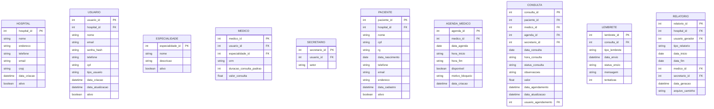

```mermaid
erDiagram
    HOSPITAL {
      int hospital_id PK
      string nome
      string endereco
      string telefone
      string email
      string cnpj
      datetime data_criacao
      boolean ativo
    }

    USUARIO {
      int usuario_id PK
      int hospital_id FK
      string nome
      string email
      string senha_hash
      string telefone
      string cpf
      string tipo_usuario
      datetime data_criacao
      datetime data_atualizacao
      boolean ativo
    }

    ESPECIALIDADE {
      int especialidade_id PK
      string nome
      string descricao
      boolean ativo
    }

    MEDICO {
      int medico_id PK
      int usuario_id FK
      int especialidade_id FK
      string crm
      int duracao_consulta_padrao
      float valor_consulta
    }

    SECRETARIO {
      int secretario_id PK
      int usuario_id FK
      string setor
    }

    PACIENTE {
      int paciente_id PK
      int hospital_id FK
      string nome
      string cpf
      string rg
      date data_nascimento
      string telefone
      string email
      string endereco
      datetime data_cadastro
      boolean ativo
    }

    AGENDA_MEDICO {
      int agenda_id PK
      int medico_id FK
      date data_agenda
      string hora_inicio
      string hora_fim
      boolean disponivel
      string motivo_bloqueio
      datetime data_criacao
    }

    CONSULTA {
      int consulta_id PK
      int paciente_id FK
      int medico_id FK
      int agenda_id FK
      int secretario_id FK
      date data_consulta
      string hora_consulta
      string status_consulta
      string observacoes
      float valor
      datetime data_agendamento
      datetime data_atualizacao
      int usuario_agendamento FK
    }

    LEMBRETE {
      int lembrete_id PK
      int consulta_id FK
      string tipo_lembrete
      datetime data_envio
      string status_envio
      string mensagem
      int tentativas
    }

    RELATORIO {
      int relatorio_id PK
      int hospital_id FK
      int usuario_gerador FK
      string tipo_relatorio
      date data_inicio
      date data_fim
      int medico_id FK
      int secretario_id FK
      datetime data_geracao
      string arquivo_caminho
    }
```